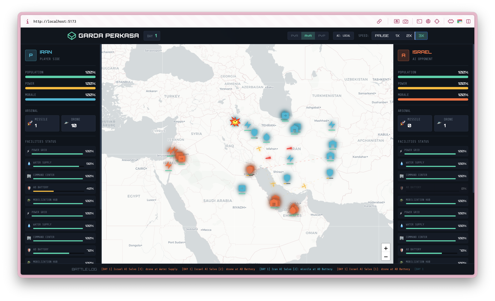

# GARDA PERKASA: Tactical Warfare Simulation

## Overview
**Garda Perkasa** is a high-fidelity, real-time tactical warfare simulation platform designed to simulate multi-front regional conflicts. Built with **React**, **TypeScript**, and **Leaflet**, it provides a command-and-control interface for managing strategic assets, analyzing threat vectors, and executing precision strikes.

## Core Features

### 🧠 Intelligent Tactical AI
*   **Strategic Doctrines**: AI agents follow advanced military doctrines, including SEAD (Suppression of Enemy Air Defenses) and infrastructure degradation.
*   **Dynamic Salvos**: Combat is non-linear; the AI launches multi-missile salvos and staggered drone strikes based on priority targets.
*   **Multi-Front Engagement**: Deployments across Israel and regional US/Allied bases (UAE, Qatar, Kuwait, Jordan).

### 🛡️ Active Air Defense & Interception
*   **Strategic Shielding**: Functional Air Defense (AD) batteries provide a cumulative interception chance to neutralize incoming threats.
*   **Tactical Shielding**: Every active battery on the map adds to the regional defensive umbrella.

### 💥 High-Fidelity Tactical FX
*   **Comic-Style Impact FX**: Realistic layered SVG explosions based on tactical reference.
*   **Real-time Trajectories**: Precision missile and drone flight paths with aerodynamic orientation.
*   **Strategic HUD**: Real-time monitoring of Population, Power, Morale, and Production Capacity.

### 🎮 Operation Modes
*   **AvA (Simulation)**: Witness autonomous tactical exchanges between coalition and regional forces.
*   **PvA (Tactical)**: Take command of regional forces against a persistent AI opponent.
*   **PvP (Command Training)**: Local multi-agent control for strategic training and scenario analysis.

## Strategic Assets
*   ⚡ **Power Grids**: Essential for production and strategic capability.
*   💧 **Water Supply**: Critical for population stability and morale.
*   🏢 **Command Centers**: The nexus of military operations and production.
*   🛡️ **AD Batteries**: Tactical air-defense umbrellas.
*   🪖 **Mobilization Hubs**: Central to troop morale and strategic reserve.

## Technology Stack
*   **Frontend**: React + TypeScript
*   **Map Engine**: Leaflet + React-Leaflet
*   **Styling**: Custom Tactical CSS (Glassmorphism / Neon-Tactical)
*   **Build Tool**: Vite

## Getting Started
1. Install dependencies: `npm install` or `bun install`
2. Run development server: `npm run dev` or `bun dev`

---
*Garda Perkasa - Strategic Engagement Engine*
